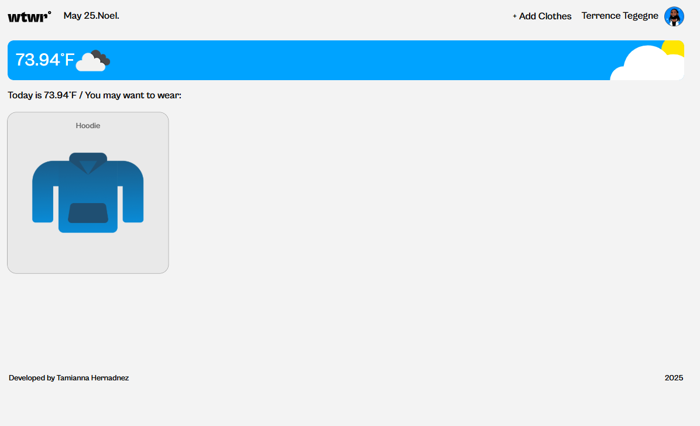
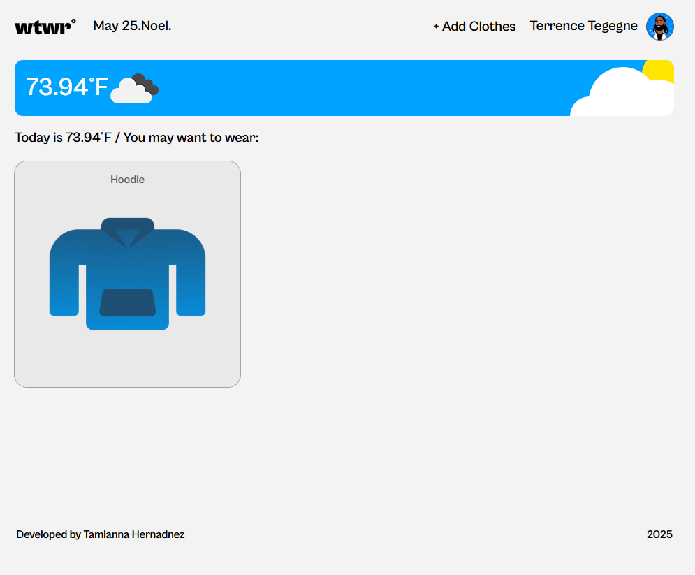
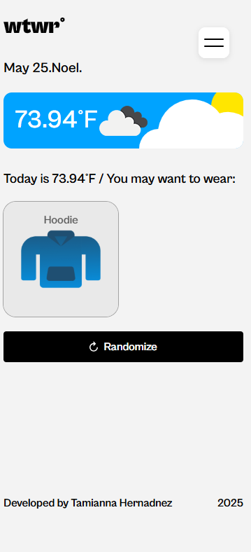
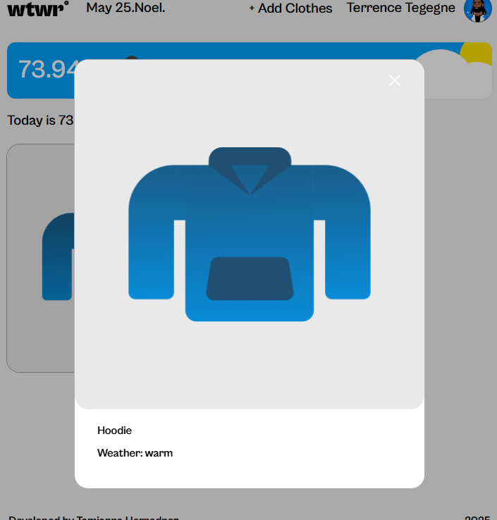
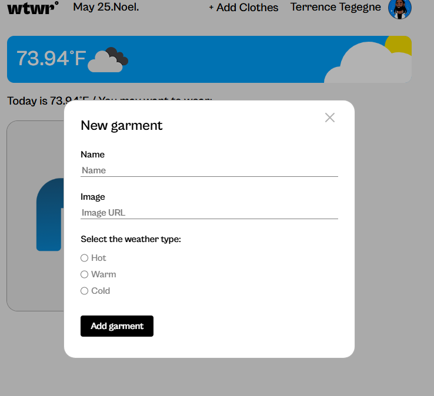
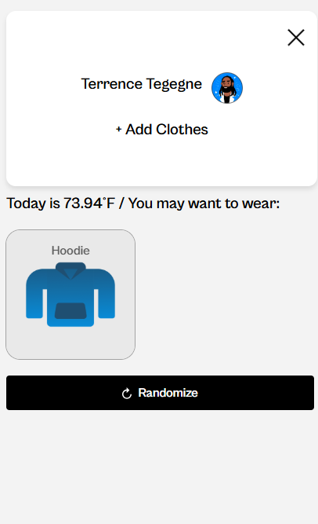

# WTWR - What To Wear Recommendation App (Frontend)

**WTWR** stands for **"What To Wear"**, a full-stack web application that reads real-time weather data from a Weather API and recommends suitable clothing based on the current conditions.

This repository contains the **frontend** of the WTWR application, built with **React** and **Vite**, focusing on responsive design and component-based architecture.

---

## 🌤 Project Overview

The WTWR app helps users decide what to wear by analyzing the current weather and suggesting appropriate clothing items. This frontend application:

- Fetches and displays weather data using a Weather API
- Dynamically renders weather-specific clothing recommendations
- Includes modal forms for adding or viewing clothing items
- Adapts seamlessly to screen sizes from **1440px** to **320px**

---

## 🔗 Live Demo

[View Deployed App](https://tamianna.github.io/se_project_react/)

---

## 🚀 Features

- 📡 Fetches real-time weather data
- 👕 Clothing recommendations based on weather
- 🧩 Modular component structure with React
- 📱 Responsive design from 1440px down to 320px
    - Flexbox and media queries ensure a consistent and adaptive UI across all devices.
- 💡 Add new clothing items
- 🔍 View clothing item details in a modal
- 📂 Mobile nav menu toggle

---

## ⚙️ Tech Stack

- **React** (Functional components & Hooks)
- **Vite** (for fast dev build and hot reloading)
- **CSS** (custom styles for responsive layouts)
- **Weather API** (external API to fetch current weather)

---

## 📸 Screenshots

### Desktop (1440px)

### Tablet (768px)

### Mobile (375px)

### 🖼️ Photo Preview Modal

### ➕ Add Garment Modal

### 📋 Mobile Navigation Menu

---