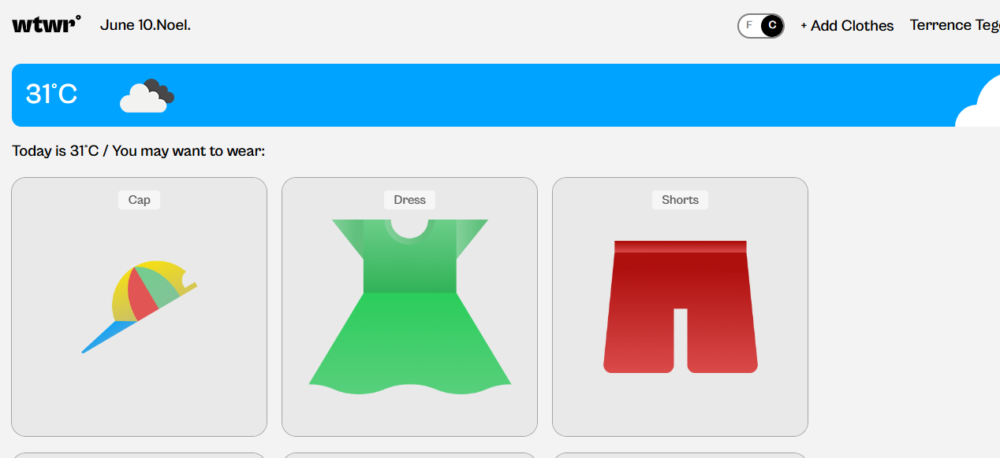
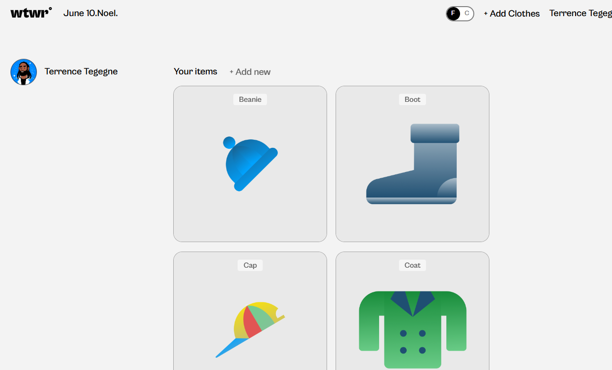
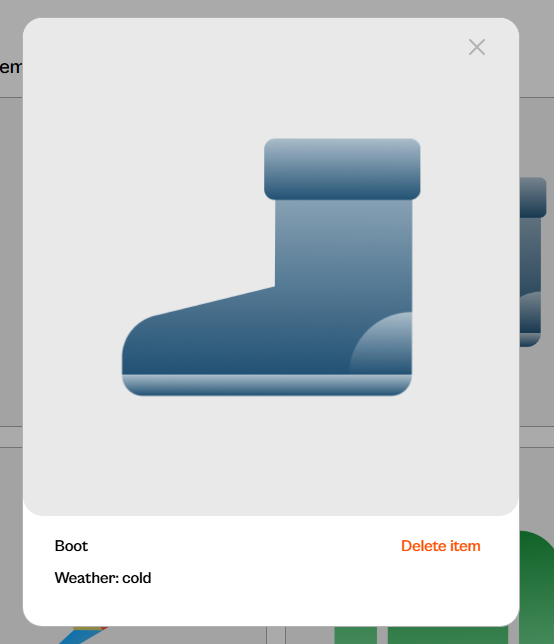
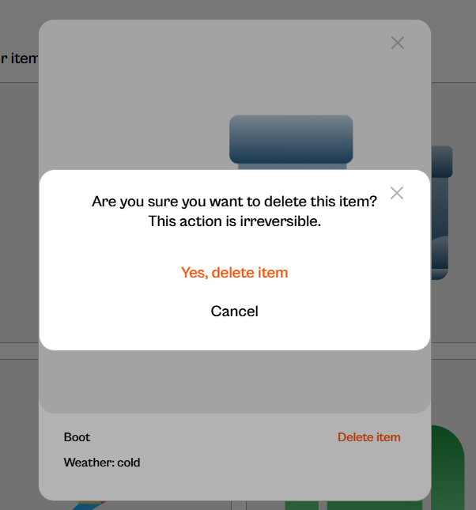
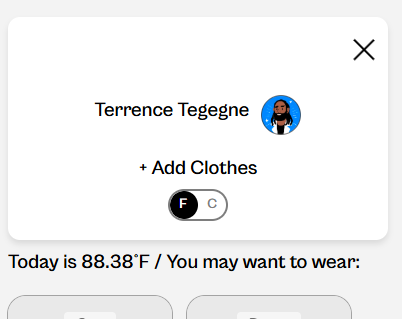
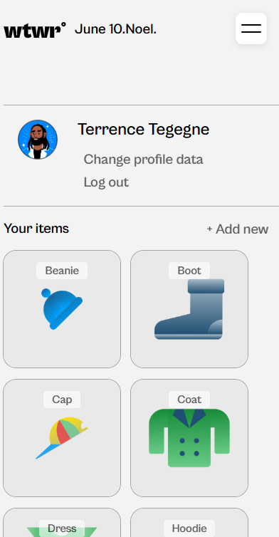

# WTWR - What To Wear Recommendation App (Frontend)

**WTWR** stands for **"What To Wear"**, a full-stack web application that reads real-time weather data from a Weather API and recommends suitable clothing based on the current conditions.

This repository contains the **frontend** of the WTWR application, built with **React** and **Vite**, focusing on responsive design and component-based architecture.

---

## 🌤 Project Overview

The WTWR app helps users decide what to wear by analyzing the current weather and suggesting appropriate clothing items. This frontend application:

- Fetches real-time weather data using a Weather API

- Dynamically renders clothing recommendations based on weather and temperature

- Allows users to add or delete clothing items via modals with confirmation and validation

- Supports user profile management and navigation

- Offers a toggle between Fahrenheit and Celsius

- Includes a mock backend for local development

---

## 🔗 Live Demo

[View Deployed App](https://tamianna.github.io/se_project_react/)

---

## 🚀 Features

- 📡 Real-time Weather Data: Fetched from an external Weather API.
 - 🌡️ Temperature Toggle: Switch between Fahrenheit and Celsius.
 - 👕 Clothing Recommendations: Shown dynamically based on weather.
- ➕ Add Item Modal: Add clothing items with client-side validation.
- ❌ Delete with Confirmation: Remove items via confirmation modal.
 - 👤 Profile Component: View and update user profile data.
 - 📂 Navigation Links: Navigate between homepage (/) and user profile (/profile).
 - 🧩 Modular React Components: Clean, maintainable, and reusable structure.
 - 📱 Responsive Design: Seamless UI on all devices via Flexbox and media queries.
 - 🧪 Validation: Ensures forms are complete and error-free before submission.
 - 🗄️ Mock Server: Local development powered by JSON Server.
- 📂 Mobile nav menu toggle

---

## ⚙️ Tech Stack

- **React** (Functional components & Hooks)
- **Vite** (for fast dev build and hot reloading)
- **CSS** (custom styles for responsive layouts)
- **Weather API** (external API to fetch current weather)
 - **JSON Server** (mock backend to simulate API interaction)
 - **React Router** (navigation between views)

---

## 📸 Screenshots

### Desktop (1440px)

### Tablet (768px)

### Mobile (375px)

### 🖼️ Photo Preview Modal

### ➕ Add Garment Modal

### 📋 Mobile Navigation Menu

### 🌡️ Temperature Toggle Switch  

### 👤 Profile Component  

### 🗑️ Delete Button  

### ❗ Delete Confirmation Modal  

### 🔄 Updated Mobile Navigation  

### 👤 Mobile Profile View  

---